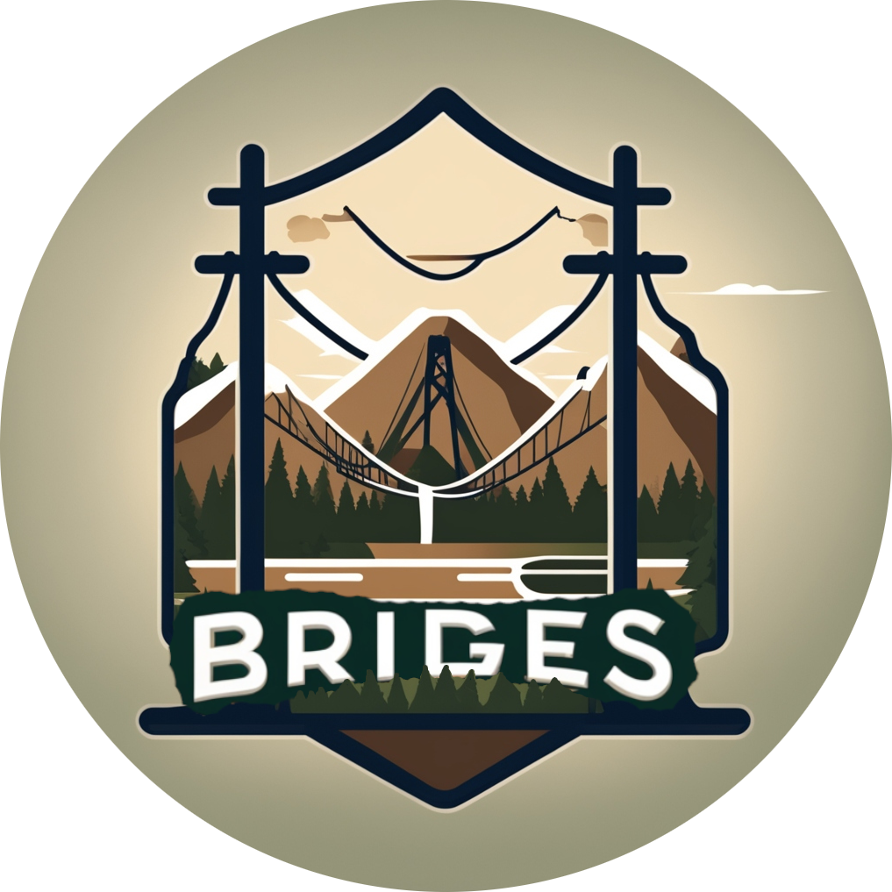

# Welcome to BRIDGES

{ width="200", align=left }

BRIDGES is a **macro-energy system model** for capacity expansion planning that is capable of **determining optimal transition pathways to a net-zero emission energy system**. The underlying large-scale linear optimization problem is designed to identify investment decisions that minimize the total societal costs of the transition path while satisfying tightening emission constraints. Such investment decisions can include the (de)commissioning of fossil-based and renewable electricity generators as well as the electrification of the building and transport sectors. The model chooses from a wide range of energy conversion technologies. One of the model's strengths is the detailed modeling of both the electricity and the gas network, thus allowing for the planning of the **co-transition of the electricity and gas sector**. 

While the framework can be adapted to any geographical region, BRIDGES is currently used to model the energy transition of the state of **California**. For that, California is spatially resolved in the [16 climate zones](https://www.energy.ca.gov/programs-and-topics/programs/building-energy-efficiency-standards/climate-zone-tool-maps-and) defined by the California Energy Commission. As temporal resolution, five investment years - equally spaced over the decarbonization timeframe - are modeled. To further reduce computational burden, a cluster algorithms identifies six representative days per investment year that are modeled at hourly resolution and subsequently concatenated into a calendar year. 

BRIDGES is under active development in the [Environmental Assessment & Optimization Group](https://eao.stanford.edu/) at Stanford University. A first version of the model has been published in [Advances in Applied Energy](https://doi.org/10.1016/j.adapen.2022.100086) (2022).

_Logo source_[^1]

[^1]: "Hey, design a logo for the energy system model BRIDGES. Include a transmission line that also looks like a bridge. Design the logo in the style of a national park emblem." https://deepai.org/