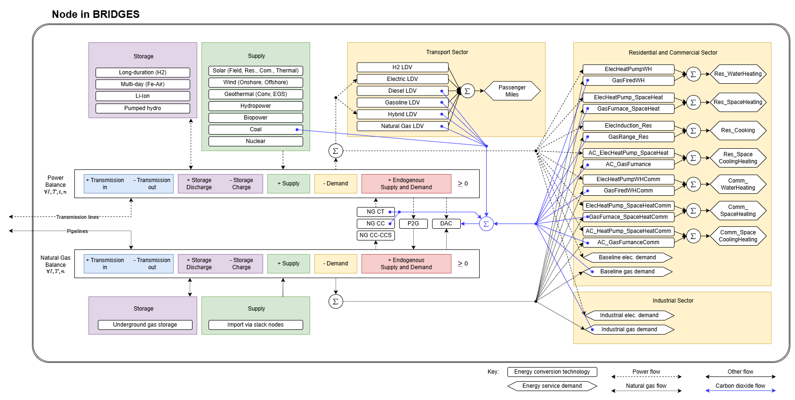

# Model structure

This section provides an overview of the equations, assumptions, and data sources underlying the BRIDGES model.

!!! tip "To-Do"

    This section has to be created.

<figure markdown>
  { width="1200" }
  <figcaption>Figure 1: Structure of the BRIDGES model</figcaption>
</figure>

