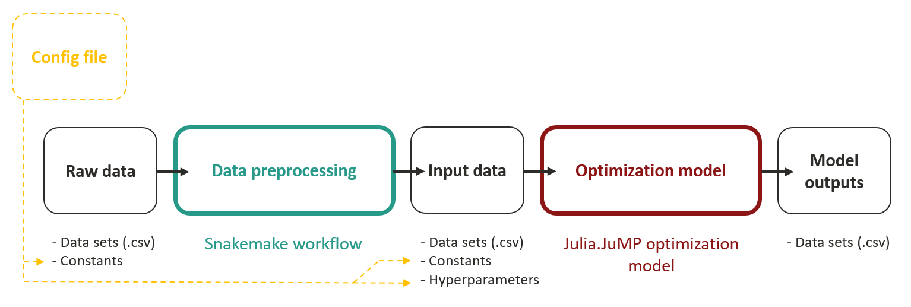

# Project structure

The goal of this section is to explain the idea behind BRIDGES' repository and to make the reader familiar with its file and folder structure as well as the flow of data. 

The BRIDGES model consists of two modules as depicted in Figure 1. The **data preprocessing pipeline** automatically downloads and processes raw data from a variety of sources and assembles the input data sets for the optimization model. The data preprocessing is implemented using the workflow management system Snakemake which allows for reproducible and adaptable data analysis. The generated input data is fed to the julia-based **optimization model** which determines optimal transition pathways for the modeled energy system. The BRIDGES model is configured through a **configuration file** that holds all model hyperparameters and constants used in the data preprocessing pipeline and the optimization model.

<figure markdown>
  { width="800" }
  <figcaption>Figure 1: Structure of BRIDGES</figcaption>
</figure>

Let's see how this structure is reflected in the code.

## Configuration file

The `BRIDGES_for_CA/config.yml` file is the one-stop main configuration file for the BRIDGES model. It contains hyperparameters of the model such as the number of representative days or toggles to switch on and off specific model features. It also holds constants that are used in the data preprocessing pipeline or the optimization model, as explained below. In summary, the configuration file is the "control center" from where scenario analyses can be conducted by modifying model hyperparameters or constants. 

!!! tip "To-Do"

    Currently, the distinction between "constants" and "hyperparameters" is not very clear in the  `config.yml` file.

## Raw data

BRIDGES uses three types of raw data: (1) Data sets that are available online and can be donwloaded automatically in machine-readible formats, such as `.csv`. (2) Data sets that were assembeled manually or extracted from other sources and cannot be accessed through a download link. (3) Constants that were collected from a variety of data sources such as journal articles, scientific reports or technical specifications.

::: DataPreprocessing.scripts.storage.dummy_generate_storage_network.copy_profile

These three types of raw data are stored in the following locations:

1. **Downloadable data sets** are not per se stored in the BRIDGES repository but rather downloaded by the Snakemake workflow upon execution using the download links provided in the main configuration file `BRIDGES_for_CA/config.yml`. The datasets are then stored in `BRIDGES_for_CA/Data/RawData`. If not deleted, you might still find the downloadable datasets in this folder.
2. **Non-downloadable data sets** are kept in `BRIDGES_for_CA/Data/NonDownloadableData`. The Snakemake workflow will look for them in this directory.
3. **Constants** are kept in the main configuration file `BRIDGES_for_CA/config.yml` where they should be accompanied with a brief explanation and a source information.

## Data preprocessing pipeline

The data preprocessing pipeline is implemented using Snakemake. In the Snakemake logic, a data processing pipeline is structured into jobs that are executed one after the other (and sometimes in parallel). Jobs are termed `rules` in Snakemake. For example, a typical pipeline could consist of a first rule that downloads a dataset and stores it in a designated folder (For BRIDGES this is `BRIDGES_for_CA/Data/RawData`). Then a second rule would take this data set, manipulate it and store it under a new file name (still in `BRIDGES_for_CA/Data/RawData`). Then, a final rule conducts another manipulation on the data and creates the target file, which is saved to `BRIDGES_for_CA/Data` and serves as input file to the optimization. Snakemake automatically determines the order in which the rules must be executed to have all necessary files in place for the subsequent rules. 

All rules are stored in the `Snakefile` (`BRIDGES_for_CA/DataPreprocessing/Snakefile`) or are imported to the Snakefile from other rule files (`BRIDGES_for_CA/DataPreprocessing/rules`). While it is possible to have all rules in the Snakefile, it is customary to organize them in multiple rule files. The action that a rule takes (e.g., a download, a manipulation) is defined in a script (.py, .jl, etc.) or as shell command. The scripts are stored in `BRIDGES_for_CA/DataPreprocessing/scripts`.

## Input data

BRIDGES uses two types of input data to the optimization model: (1) Data sets that have been placed in the folder `BRIDGES_for_CA/Data` by the data preprocessing pipeline. (2) Constants kept in the main configuration file `BRIDGES_for_CA/config.yml` where they should be accompanied with a brief explanation and a source information. (3) The hyperparameters of the optimization model that determine the structure of the model (e.g., the number of representative days, toggles to turn on specific model features).

## Optimization model

The optimization model is located in `BRIDGES_for_CA/run_file.jl`. Instead of including the model as one long script, it is organized in a collection of julia scripts that are imported from `BRIDGES_for_CA/core`:

* `parameters.jl` imports the constants from the configuration file `BRIDGES_for_CA/config.yml` and turns them into julia variables. A few first computations are performed.
* `data_imports.jl` imports the input data sets from `BRIDGES_for_CA/Data`. A few first computations are performed.
* `clustering.jl` identifies the representative days based on hourly demand profiles and hourly renewable generation profiles.
* `cons_capacity.jl`, `cons_dispatch.jl`, `cons_flow.jl`, `cons_policy.jl` contain the definitions of the optimization variables and constraints in julia.JuMP syntax.
* `optimize.jl` contains the objective function.
* `data_exports.jl` exports the optimal values of relevant decision variables upon optimization completion. The data is exported to `BRIDGES_for_CA/Output`.

!!! tip "To-Do"

    Actually, `data_exports.jl` currently exports to `BRIDGES_for_CA/core/Output`?!

## Model output data

BRIDGES makes the results of the optimization model available in `BRIDGES_for_CA/Output`. These data sets contain the optimal values of key decision variables. Individual plotting scripts can be written to analyze and visualize the identified transition path. 

!!! tip "To-Do"

    Actually, `data_exports.jl` currently exports to `BRIDGES_for_CA/core/Output`?!

## Summary & File tree

    BRIDGES_for_CA:
    │   config.yaml                     # Main configration file of BRIDGES. Includes model hyperparameters and constants used in the optimization model or the data preprocessing. Modify this file for scenario analysis.
    │   mkdocs.yml                      # Set layout of documentation here.
    │   my_job.script                   # Used to request resources and run BRIDGES on the Sherlock cluster. Runs the data preprocessing (`insert command`) and the optimization (`srun julia run_file.jl`). For details see "Running BRIDGES".
    │   README.md                       # Read me.
    │   run_file.jl                     # Run this file to run the optimization model. For details see "Running BRIDGES".
    │   
    ├───core                            # Contains optimization model. The julia scripts are imported into `run_file.jl`.   
    │       clustering.jl               # Script that identifies representative days using a clustering algorithm.
    │       cons_capacity.jl            # Script that contains definition of optimization variables and constraints.
    │       cons_dispatch.jl            # Script that contains definition of optimization variables and constraints.
    │       cons_flow.jl                # Script that contains definition of optimization variables and constraints.
    │       cons_policy.jl              # Script that contains definition of optimization variables and constraints.
    │       data_exports.jl             # Script that reads optimization results and creates model output data at `BRIDGES_for_CA/Output`.
    │       data_imports.jl             # Script that loads input data (data sets) to the optimization model from `BRIDGES_for_CA/Data`.
    │       optimize.jl                 # Script that contains objective function of optimization.
    │       parameters.jl               # Script that loads input data (constants) and model hyperparameters to the optimization model from `BRIDGES_for_CA/config.yml` and turns them into julia constants available in the other scripts.
    │
    ├───Data
    │   │   ...                         # Stores input data sets for the optimization model. Files here are generated by the data preprocessing pipeline (Snakemake workflow).
    │   │
    │   ├───NonDownloadableData         # Stores raw data that cannot be downloaded from the internet automatically.
    │   └───RawData                     # Stores data sets that are downloaded by the Snakemake workflow or created as interim files within the Snakemake workflow.
    │
    ├───DataPreprocessing               # Contains the data preprocessing pipeline (Snakemake workflow)
    │   │   Snakefile                   # Run this file to run the data preprocessing pipeline. For details see "Running BRIDGES".
    │   │
    │   ├───rules                       # Contains the Snakemake rules that make up the data preprocessing pipeline. Rule files are imported into the Snakefile (`BRIDGES_for_CA/DataPreprocessing/Snakefile`).
    │   └───scripts                     # Contains the scripts that are used by the Snakemake rules.
    │
    ├───docs                            # Contains the documentation of BRIDGES. 
    │   │   ...                         # Contains the pages of the documentation.
    │   │
    │   ├───images                      # Contains the images used in the documentation.
    │   └───stylesheets                 # Contains custom layout settings. The main layout is set in `BRIDGES_for_CA/mkdocs.yml`. 
    │
    ├───Output                          # Folder to store model output files generated in `BRIDGES_for_CA/core/data_exports.jl`.
    └───Plots                           # Folder to store plots generates from data sets in `BRIDGES_for_CA/Output`.

!!! tip "To-Do"

    Include command for running snakemake on Sherlock to `my_job.script` and the file tree above.