# Introduction to Sherlock

Sherlock is Stanford's high-performance computing cluster ([Website](https://www.sherlock.stanford.edu/) | [Documentation](https://www.sherlock.stanford.edu/docs/)). In simple words, users have a file folder available online in which they can create new sub-directories, upload code and data, and even install software. Some software is [preinstalled](https://www.sherlock.stanford.edu/docs/software/). To run code, users have a linux-based command line/terminal available. When opening the command line, the user is first connected to a "login node" on which no heavy computation jobs can be executed. Instead, the user specifies in the login node command line which command he would like to run and how much resources the scheduler (called "slurm") should allocated to this job. For that, the user uses slurm commands, as described [here](https://www.sherlock.stanford.edu/docs/user-guide/running-jobs/#login-nodes) and in our short documentation below. Moreover, users can decide between running an "interactive job" or submitting a "batch job" as also described [here](https://www.sherlock.stanford.edu/docs/user-guide/running-jobs/#login-nodes). Using Sherlock is free of cost, but when requesting large resources your job will take longer to start.

## Step 1: Requesting a Sherlock Account

Stanford students can request access to Sherlock. Go to the [Sherlock homepage](https://www.sherlock.stanford.edu/) and klick "Request an account". After requesting, check your emails for further information. You will be CCed in an email to your PI, to which your PI has to reply and consent that an account is created for you. There are regular onboarding session and Youtube recordings.

We are familiar with two ways to connect to Sherlock: through Sherlock's web interface and by connecting your VS Code to Sherlock so that so that the folder structure on Sherlock appears as "normal" workspace folder in VS code.

## Step 2a: Connecting to Sherlock through the web interface

1. Follow the link: [https://ondemand.sherlock.stanford.edu/](https://ondemand.sherlock.stanford.edu/). At the time of writing this documentation, this has to be done in an incognito window of your browser. 
2. Sign in and complete multi-factor authentification if prompted.
3. Then click `"Files" > "Home Directory"` to access your folder on Sherlock. Upload and download files and maintain your folder using the corresponding buttons.
4. Click `"Open in Terminal"` to open the linux-command line in your directory (you will find yourself on a login node). Use commands such as `cd somefoldername` or `ls` to explore your folder system. By going up folders (`cd ..`) you can switch to your group's home directory.
5. Read "Step 3: Submit a batch job" below on how to run code.

## Step 2b: Connecting to Sherlock through VS Code

!!! note

    The following tutorial was originally written for Mac. However, it is also very accurate for Windows machines and we have added Windows-specific instructions in boxes like this.

* Download VSCode: [https://code.visualstudio.com](https://code.visualstudio.com)
* In VSCode, go to Extension on the right column and install “SSH FS”:
<figure markdown>
  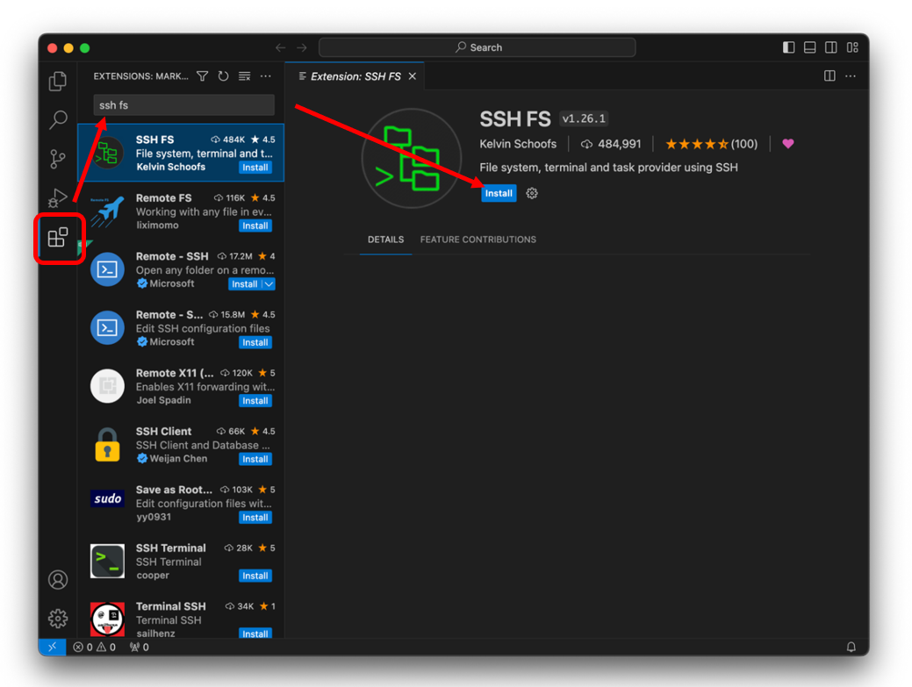{ width="600" }
</figure>

* Once installed, under “Configurations,” add new configuration and save:
<figure markdown>
  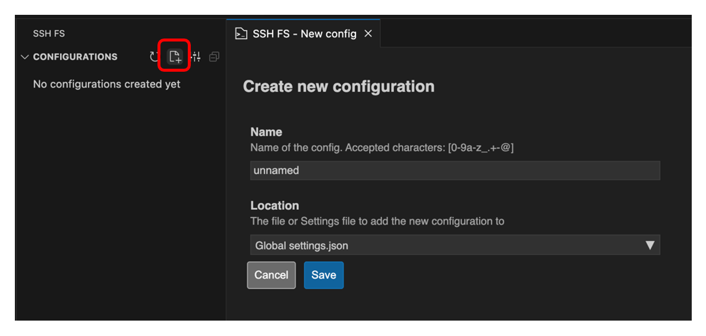{ width="600" }
</figure>

* It should then take you to the “Edit config” page where you can edit the configuration. If it doesn’t, click on the wheel button next to your “unnamed” configuration:
<figure markdown>
  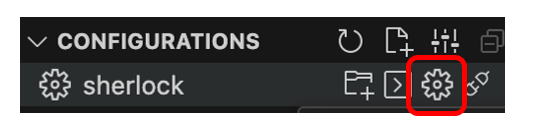{ width="300" }
</figure>

* Apart from the following parameters, you can leave everything as default or blank:
```
Name: sherlock
Host: login.sherlock.stanford.edu
Root: ~
Username: *your Stanford id username*
Password: *your Stanford password*
```
<figure markdown>
  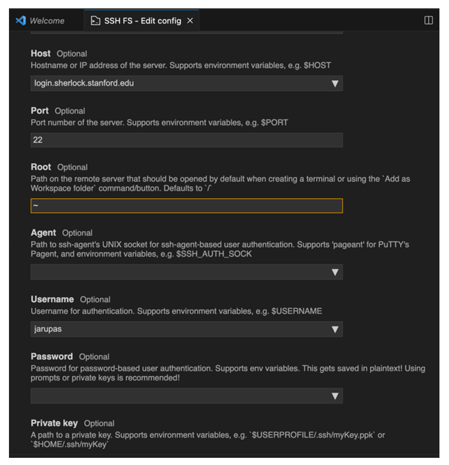{ width="600" }
</figure>
(Notes: Including username and password in the configuration makes it easier to login in but is optional. Entering ~ in Root takes  me to my `sherlock/home/users/jarupas`. If you need to access a different starting directory such as scratch, then I think you will need to enter something else.)

* Hit "Save" when done.
* Now, I click “Add as Workspace folder.”
<figure markdown>
  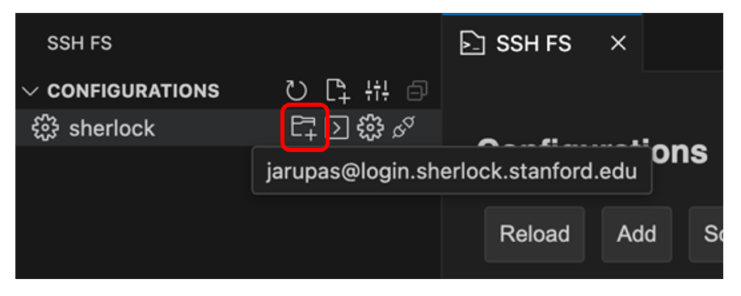{ width="600" }
</figure>

* It will prompt you to Duo two-factor login. I’m not sure why, but here, I always have to enter two-factor twice before it goes through.
<figure markdown>
  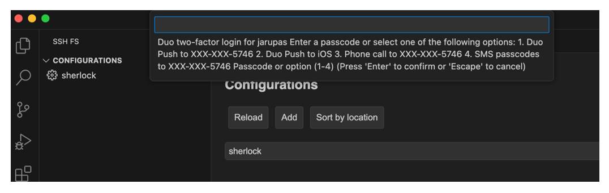{ width="600" }
</figure>

* Once connected, the bottom of VSCode should show this symbol. Now, I can access my files and folders, make changes, and save in Sherlock. 
<figure markdown>
  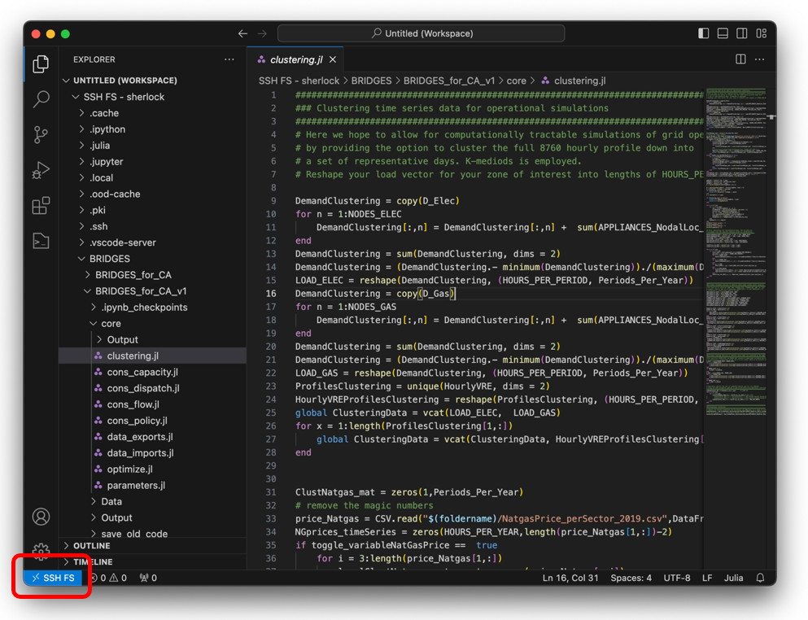{ width="600" }
</figure>
!!! note
    For VS Code on Windows this is not necessarily the case - don’t worry if it does not.

* Though you can interact with files, you can’t interact with Sherlock’s terminal. To do so you have to connect separately to Sherlock’s terminal via SSH, in the steps below. (Further information can also be found [here](https://www.sherlock.stanford.edu/docs/getting-started/connecting/#connection).)
* You can do this via VSCode or Terminal. For terminal, open:
<figure markdown>
  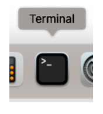{ width="100" }
</figure>
For VS Code, click the terminal tab and "New Terminal" or click the "problems" button at the bottom of the screen and click "Terminal":
<figure markdown>
  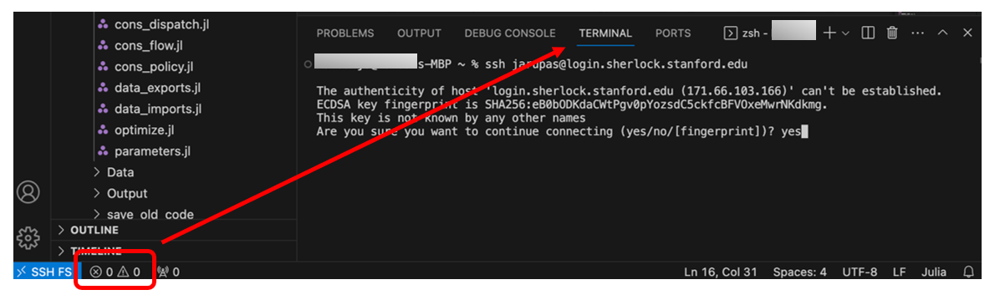{ width="600" }
</figure>
First time you connect remotely, it will give a warning. Type “yes” when prompted are you sure.

* With successful login, you will see:
<figure markdown>
  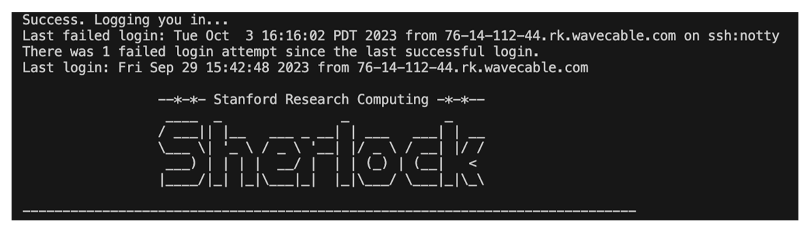{ width="600" }
</figure>

* Read "Step 3: Submit a batch job" below on how to run code.

## Step 3: Submit a batch job

While there are other ways of running code on Sherlock (e.g., interactive scripts), we focus on running batch jobs here.

* To submit a job script, we have a file on Sherlock called “my_job.script” that contains all the requests we want to make to Sherlock such as number of nodes, memory, CPU, partition, time request. **Below is an example, but note that the current script file in the repository might have been updated since this documentatiom was written**. We find SERC partition to be the fastest partition to provide us a node because it is exclusive to the School of Earth or something. If you need a lot of memory, you will have to request the BIG MEM partition.
<figure markdown>
  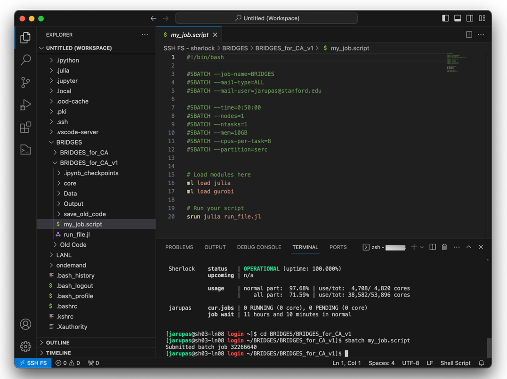{ width="600" }
</figure>

``` title="my_job.script"
#!/bin/bash

#SBATCH --job-name=BRIDGES
#SBATCH --mail-type=ALL
#SBATCH --mail-user=your_username@stanford.edu

#SBATCH --time=0:50:00
#SBATCH --nodes=1
#SBATCH --ntasks=1
#SBATCH --mem=10GB
#SBATCH --cpus-per-task=8
#SBATCH --partition=serc

# Load modules here
ml load some_module 
ml load gurobi

# Run your script
srun julia run_file.jl
```

* To submit the file, type into Sherlock terminal `sbatch my_job.script`. Make sure you are in the folder that your job script file is in first, though. For instance, when I open my SSH I am in `sherlock/home/users/jarupas`. I need to enter the following command to get to my working folder: `cd BRIDGES_in_CA`.

!!! note

    Especially on Windows, you might run into the following error when executing `sbtach my_job.script`:

    ```
    sbatch: error: Batch script contains DOS line breaks (\r\n) 
    sbatch: error: instead of expected UNIX line breaks (\n)
    ```

    The reason is that your “my_job.script” file is using Windows line breaks instead of Unix line breaks. This most likely happened when you cloned/downloaded the BRIDGES Repo to your Windows machine. There are [different ways](https://support.nesi.org.nz/hc/en-gb/articles/218032857-Converting-from-Windows-style-to-UNIX-style-line-endings) for converting the file back to Unix line breaks. The easiest approach is to simply run the following command in the (Sherlock) terminal:
    
    ```
	dos2unix my_job.script
    ```

    Probably, the dos2unix program is already installed on your machine so that you don’t have to download it.

* Once the job request starts as well as when the job is done (either complete or if it failed!), it will send you info to your Stanford email. It’ll tell you how much memory was used, run time, etc. It will also output a “.slurm” file to your `BRIDGES_in_CA` folder which will contain all your printouts from your run.
<figure markdown>
  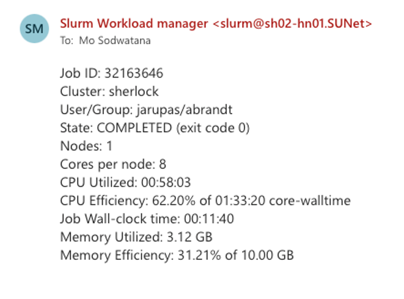{ width="400" }
</figure>

* Other useful commands are:
```
squeue -u your_username         # to view your submitted job(s), see screenshot below
scancel your_job_id             # to cancel your job
```

* **For specific instructions how to run BRIDGES, make sure to also read the section "Running BRIDGES".**