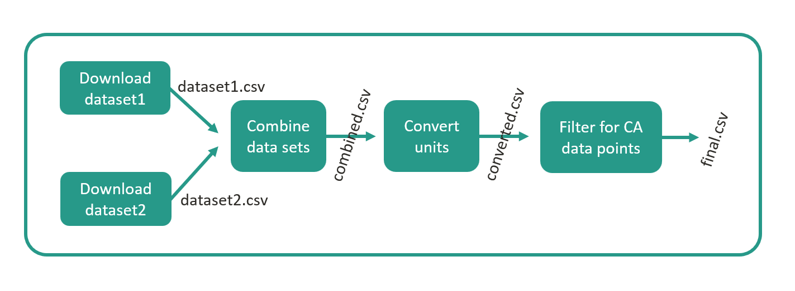

# Introduction to Snakemake

## What is Snakemake?

Snakemake is a **tool for implementing and organizing data processing pipelines**. In BRIDGES, we use Snakemake to implement our data preprocessing pipeline that gathers raw data and processes it into the format expected by the optimization model (see section "Project structure"). It should be mentioned that Snakemake is also used in other macro-energy system models such as [PyPSA](https://pypsa.org/) and [(Euro-)Calliope](https://euro-calliope.readthedocs.io/en/latest/). On this page, our goal is to provide all information about Snakemake that are needed to use it in the context of BRIDGES. The full documentation of Snakemake can be found [here](https://snakemake.readthedocs.io/en/stable/). Another very helpful software carpentry lesson can be found [here](https://carpentries-incubator.github.io/workflows-snakemake/setup.html) (note, that the suggested installation is a bit complex since additional software for the tutorial is installed).

Snakemake is based on the notion that data processing pipelines can be broken down into a series of smaller jobs, called "rules", that are executed one after the other (or in parallel, if possible). An exemplary Snakemake data processing pipeline is shown in Figure 1. In the example, two rules download data sets from the internet and store them locally as `dataset1.csv` and `dataset2.csv`. Then, a third rule combines the two data sets into a file called `combined.csv`, which is further manipulated into `converted.csv` and `final.csv`. The latter represents the "target file" of this pipeline. The interim files may be deleted or kept. Note how the download rules can be parallelized as they do not depend on other files to be created first.

<figure markdown>
  { width="700" }
  <figcaption>Figure 1: Exemplary Snakemake workflow</figcaption>
</figure>

The rules are defined in a so-called Snakefile using Snakemake's syntax. Based on the filepaths provided as "input" and "output" of the rules, Snakemake determines the order in which the rules have to be executed and whether parallelizations are possible. Snakemake does not take care of creating or manipulating files, but expects scripts or shell commands to be provided to the rule. The provided script or shell command is executed as part of the rule execution and uses the file(s) specified as "input" to create the file(s) specified as "output". Scripts can be written in most common programming languages, including Python and Julia.


The Snakefile of the example shown in Figure 1 would look like this:

```yaml title="./Snakefile" linenums="1"
""" Snakefile"""

configfile: "config.yaml"                               # Specifies path to a dictionary-like configuration file. Constants stored in this configuration file are available in the Snakefile (see rule "download_dataset2").

include: "./rules/some_more_rules.smk"                  # Instead of having all rules in a single Snakefile, they can be organized in multiple rule files that are imported to the main Snakefile using this command.

# Rules
rule download_dataset_1:                                # Specify the name of the rule.
    message: "Download dataset 1."                      # Provide a short description of the rule.
    params: url = "https://some_url.com"                # List parameters of the rule, they will be available in the shell command and scripts.
    output: "dataset1.csv"                              # Provide the file(path) that will be created by executing the rule's script/shell command. This example rule does not have an input file.
    shell: "curl -sLo {output} {params.url}"            # Provide a shell command (or script) that generates the specified output files. We prefer scripts as they are platform agnostic. Access rule parameter using "{...}" and dot notation.

rule download_dataset_2:
    message: "Download dataset 2."
    params: url = config["download-links"]["dataset2"]  # The rules can access constants from a dictionary-like yaml file specified at the top of the Snakefile.
    output: "dataset2.csv"
    shell: "curl -sLo {output} {params.url}"

rule combine_datasets:
    message: "Combines datasets."
    input:                                              # This rule has two input files.
        dataset1 = "dataset1.csv",                      # Input files can be either referenced by their plain file path ...
        dataset2 = rules.download_dataset_2.output[0]   # ... or by accessing the attributes of other rules using dot notation.
    output: "combined.csv"
    conda: "env_for_combine_datasets.yaml"              # The yaml file is used to create an isolated environment in which "combine_datasets.py" is executed. List in this yaml file all packages needed for the script. This line is only used for rules that use python scripts (not julia scripts). See below for format of yaml file.
    script: "./scripts/combine_datasets.py"             # This rule provides a Python script (instead of the shell commands in the rules above).

rule convert_units:
    message: "Converts units of dataset."
    params: conversion_factor = 1000
    input: "combined.csv"
    output: "converted.csv"
    conda: "env_for_combine_datasets.yaml"              # As in the previous rule, this file specifies the environment for the script to be executed in. Note, how the same environment as for the previous rule is used. This is possible when both scripts require the same packages - it is computationally cheaper than creating two environments.
    script: "./scripts/convert_units.py"

rule filter_for_CA:
    message: "Filter for California data points."
    input: "converted.csv"
    output: "final.csv"
    script: "./scripts/filter_for_CA.jl"                # This rule uses a julia script. Note, that no conda environment is specified. This is only done for python scripts.
```

The configuration file imported to the Snakefile has the following format:

```yaml title="./config.yaml" linenums="1"
download-links:
    dataset2: "https://some-link-to-dataset2.com"
```

The environment file used in the rules `combine_datasets` and `convert_units` has the following format:

```yaml title="./envs/env_for_combine_datasets.yaml" linenums="1"
name: env_for_combine_datasets
channels:
    - conda-forge
dependencies:
    - pandas=1.3.5
    - pip=22.3.1
    - pip:
        - openpyxl==3.0.10
```

As example scripts, minimal scripts of the `convert_units` and `filter_for_CA` rules are provided below. They try to follow the [Python Style Guide](https://peps.python.org/pep-0008/) and [Julia Style Guide](https://github.com/invenia/BlueStyle). Note how the scripts access the rule's input, output, and parameter using dot notation (Look for this at the bottom of the scripts).

```py title="./scripts/convert_units.py" linenums="1"
import pandas as pd


def convert_units(input_csv_path: str,
                  output_csv_path: str,
                  conversion_factor: int) -> None:

    """
    Reads the csv file from input_csv_path into a dataframe, converts the data 
    from GWh to MWh, and writes the resulting dataframe to a csv file output_csv_path.

    Parameters:
        input_csv_path (str):
            the csv file to import
        output_csv_path (str):
            the path for saving the dataframe
        conversion_factor (int):
            conversion factor to turn GWh into MWh
    """

    # Read CSV file into a DataFrame
    df = pd.read_csv(input_csv_path)

    # Do some conversion here (using conversion_factor).

    # Write DataFrame to CSV file
    df.to_csv(output_csv_path, index=False)

    # Display some message
    print(f"DataFrame written to: {output_csv_path}")

if __name__ == "__main__":
    copy_profile(
        input_csv_path=snakemake.input[0], # this would be [1] in a julia script
        output_csv_path=snakemake.output[0],
        conversion_factor=snakemake.params["conversion_factor"]
    )
```

```jl title="./scripts/filter_for_CA.jl" linenums="1"
using CSV
using DataFrames

"""
    filter_for_CA(input_csv_path::AbstractString, output_csv_path::AbstractString) -> None

Reads the csv file from input_csv_path into a dataframe, filters for CA data points, and writes the resulting dataframe to a csv file output_csv_path.

# Arguments:
- `input_csv_path::AbstractString`: the csv file to import
- `output_csv_path::AbstractString`: the path for saving the dataframe

# Returns:

"""
function copy_profile(; input_csv_path::AbstractString, output_csv_path::AbstractString)
    
    # Read CSV file into a DataFrame
    df = CSV.File(input_csv_path) |> DataFrame

    # Do some filtering here.

    # Write DataFrame to CSV file in the output directory
    CSV.write(output_csv_path, df)

    # Display some message
    println("DataFrame written to: ", output_csv_path)
end

if abspath(PROGRAM_FILE) == @__FILE__
    copy_profile(

        input_csv_path=snakemake.input[1], # this would be [0] in python scripts
        output_csv_path=snakemake.output[1]
    )
end
```

The example above would be organized in a folder structure like the following. Official guidelines on the folder structure for Snakemake projects can be found [here](https://snakemake.readthedocs.io/en/stable/snakefiles/deployment.html#distribution-and-reproducibility). 

    ProjectRootDirectory
    │   config.yaml
    │   Snakefile
    │
    ├───.snakemake
    │
    ├───rules
    │       some_more_rules.smk
    │  
    ├───envs
    │       env_for_combine_datasets.yaml    
    │ 
    └───scripts
            combine_datasets.py
            convert_units.py
            filter_for_CA.jl

Finally, let's discuss **two common additions to the Snakefile**. (1) When executing the Snakemake workflow, i.e., running the Snakefile (c.f., section "Running Snakemake"), per default only the first rule in the Snakefile is executed. Therefore, per convention, a "run_all" rule is created at the top of the Snakefile. This rule takes the target file(s) of the workflow as inputs and therefore triggers the execution of all rules. (2) Secondly, at the end of the Snakefile there are often rules provided that remove the interim files created during the workflow execution. They are not part of the workflow and have to be executed separately (c.f., section "Running Snakemake"). Snakemake also provides an automatic way of deleting interim files (c.f., section "Advanced Snakemake features"). For the example above, these additions result in the following Snakefile:

```yaml title="./Snakefile" linenums="1" hl_lines="7-10 15-25"
""" Snakefile"""

configfile: "config.yaml"                               # Specifies path to a dictionary-like configuration file. Constants stored in this configuration file are available in the Snakefile (see rule "download_dataset2").

include: "./rules/some_more_rules.smk"                  # Instead of having all rules in a single Snakefile, they can be organized in multiple rule files that are imported to the main Snakefile using this command.

# First rule
rule run_all:
    message: "By requesting target files as input, triggers execution of workflow."
    input: "final.csv"

# Rules
## remains as above

# Cleaning rule(s)
rule clean_all:
    message: "Removes interim files generated by the workflow."
    shell:                                              # This rule also demonstrates how to use a multi-line shell command.
        """
        del /Q /F "dataset1.csv"                        # Instead of deleting each file separately, have folder where all temporary files go.
        del /Q /F "dataset2.csv"                        # Note that this command only works on windows. For unix-like terminal use: rm -r "filename.csv"
        del /Q /F "combined.csv"
        del /Q /F "converted.csv"
        """
```

## Advantages & Limitations of Snakemake

Some advantages of using Snakemake include:

* **Reproducibility:** For creating reproducible research and making the developed tool available for other researchers, it is key to also publish the data preprocessing pipeline. Snakemake allows to clearly structure and document the data processing pipeline starting at the raw data and execute it.
* **Maintenance:** A well-structured data preprocessing pipeline makes code maintenance easier, e.g., switching to updated datasets.
* **Partial pipeline execution:** When executing the processing pipeline, Snakemake only executes rules where the input data file younger than the output data file, therefore saving computation time. (Snakemake can also be forced to re-execute all rules, c.f., section "Running Snakemake").
* **Reusability:** By breaking down the data processing pipeline into jobs, these jobs can be reused in other parts of the data preprocessing. For example, a rule that converts values in a `.csv` file from MWh to GWh.
* **Language agnostic:** Snakemake allows for the use of data processing scripts in various programming languages, including Python and Julia.
* **Parallelization:** When executing Snakemake on a cluster, parallel rules/jobs are scheduled to run in parallel, reducing computation time. 

Some limitations of using Snakemake include:

* Snakemake has a **better support for Unix-like operating systems** than for Windows. 
* The use of Snakemake **introduces new software/syntax** to your project, which might make onboarding of new team members slower.

## Installation

This section covers the installation of Snakemake and Graphviz (for visualization of pipelines) on your local machine, for example to run BRIDGES **locally** or construct an example pipeline similar to the one above. **See also "Running BRIDGES" for more BRIDGES-specific instructions including the use of Snakemake on the cluster.**

### Snakemake

Activate your virtual or conda environment (if you use one) and install Snakemake via the command line using one of the following commands (depending on whether you use Anaconda or Pip):

```
conda install -c bioconda -c conda-forge snakemake-minimal
```
or
```
pip install snakemake
```

These commands hold true for both Unix and Windows based systems and provide all the functionality needed for running BRIDGES. More comprehensive installation instructions can be found [here](https://snakemake.readthedocs.io/en/stable/getting_started/installation.html) or in [this](https://carpentries-incubator.github.io/workflows-snakemake/setup.html) very helpful software carpentry workshop. Note, that in both tutorials the installation is more complex as additional software is included needed for the respective tutorials.

!!! note

    At the time of writing this documentation, an incompatibility between snakemake and the newest version of the package "pulp" exists. For now, proceed without worrying but if you run into issues, come back and simply downgrade pulp using the command `pip install --force-reinstall -v "pulp==2.7.0"`.

### Graphviz

Snakemake offers the feature to plot the data processing pipeline as directed acyclic graph (dag) (see how to do this in section "Running Snakemake"). To use this feature, install `graphviz` in your virtual or conda environment (if you use one). For Mac follow [these installation instructions](https://graphviz.org/download/#mac). For Windows, follow [these installation instructions](https://forum.graphviz.org/t/new-simplified-installation-procedure-on-windows/224).

### Snakemake extension for VS Code

If working in VS Code, consider downloading and enabling the "Snakemake Language" extension, which makes working in rule files more convenient.

## Running Snakemake

This section explains key commands used to run Snakemake generally. **For instructions specific to BRIDGES, see section "Running BRIDGES".**

Once Snakemake is installed, it is run from the command line. Open a terminal, make sure the virtual/conda environment with Snakemake (and Graphviz, if desired) is activated. Then, navigate (using "cd" commands) to the folder in which the Snakefile is located.

Now, run one of the following commands:
```
snakemake                                       # Snakemake will execute the first rule in the Snakefile. If this is a "run_all" rule, the entire pipeline will be executed (c.f., section "What is Snakemake?").
snakemake --cores all                           # Newer versions of Snakemake require the "cores" flag to be set. To be safe, always include this flag.
snakemake run_all --cores all                   # You can also execute a specific rule. Snakemake will also execute all rules that are necessary to build the input files of the specified rule.
snakemake combine_datasets --cores all          # Same
snakemake clean_all --cores all                 # Same (Executes the rule designed to clean up data generated in earlier executions, c.f., section "What is Snakemake?")
snakemake converted.csv --cores all             # You can also provide a file(path) and Snakemake will identify and execute the rule that has the provided file as output. Snakemake will also run all rules that are necessary to build the input files for this rule.
snakemake run_all --cores all --use-conda --conda-frontend conda    # To use the isolated conda environments for each rule ("conda:" in the example above) include the "--use-conda" flag. "--conda-frontend conda" is included since, by default, snakemake tries using mamba instead of conda. Mamba creates environments faster, but requires a separate installation.
snakemake run_all --cores all -n                # When providing the "-n" flag, Snakemake does not actually execute the rules but simply provides a list of rules that would have been executed.
snakemake combine_datasets --cores all -f       # When providing the "-f" flag, Snakemake forces the execution of a rule even if the rule's input files are older than its outputs files. Similarly, the "-F" flag forces the execution of the specified and all other upstream rules.
snakemake --dag run_all | dot -Tsvg > dag.svg   # When running this command, Snakemake will create a directed acyclic graph (dag, similar to Figure 1) of all rules leading up to the "run_all" rule. Note, that this command requires the installation of Graphviz (see section "Installation" above).
```

## A word on Windows vs Mac

Snakemake is developed by a team working on Mac and Linux (unix-like operating systems). Thus, support for Windows is somewhat limited. Nevertheless, Snakemake can be used on Windows machines without major problems. Caution is advised whenever it comes to executing code in the command line, since bash (unix-based) and cmd (Windows) have a different syntax. In Snakemake - how we use it - this happens on two occasions only:

1. **Command to visualize the data pipeline:** As explained above `snakemake --dag run_all | dot -Tsvg > dag.svg` generates a directed acyclic graph of the pipeline (provided that Graphviz is installed). This is bash-specific piping syntax. Conveniently, the command also works in cmd command lines, potentially, because git is installed on the Windows machine where we tested it ([Why git might help.](https://carpentries-incubator.github.io/workflows-snakemake/setup.html)).
2. **In rules that execute shell commands:** Snakemake rules either execute scripts (`script: ...`) or shell commands (`shell: ...`). In BRIDGES we prefer to use scripts, to keep the code platform-independent. However, download rules and  and clean up rules usually stick to shell commands in bash syntax (`shell: "curl -sLo {output} {params.url}"` and `shell: "rm -r "filename.csv"`). Testing the commands in the Windows command line once again revealed that the download command also works on Windows (potentially, because git is installed on the Windows machine where we tested it ([Why git might help.](https://carpentries-incubator.github.io/workflows-snakemake/setup.html))). However, should the clean up command be used by a Windows-based researcher, it had to be changed to `shell: "del /Q /F "filename.csv""` in order to work on Windows.

Let's make sure to keep the number of command line commands as small as possible in the project to avoid problems. Whereever inevitable, use bash syntax to keep the repository Mac-friendly. Windows users can then replace the few lines of code in their local repositories, use a "Windows Subsystem for Linux (WSL)", or make use of git like [this](https://carpentries-incubator.github.io/workflows-snakemake/setup.html). This mild incompatibility has not deterred other macro-energy system models, such as PyPSA and (Euro)Calliope from using Snakemake.

## Tips and common implementation errors

* If running snakemake and being prompted "Nothing to be done..." that means that all input and output files of the pipeline already exist. Delete them or some of them (manually or using the cleaning rule) or force the rule execution using the "-f" or "-F" flag (c.f., "Running Snakemake").
* Debugging is a little bit harder in Snakemake (the errors can be a bit cryptic), so to make your life easier ensure that your scripts are working before including them into the Snakemake pipeline.
* Paths in Snakemake are relative to the location of the Snakefile.
* Don't forget commas to separate multiple input or output files.
* When using dot notation to access the outputs/inputs of other rules remember to use [0], [1], ... (or [1], [2], ... in Julia scripts). Example: `input: dataset2 = rules.download_dataset_2.output[0]`.


## Advanced Snakemake features

Snakemake offers a vast majority of options. This section mentions a few that might be worth looking into moving forward with BRIDGES. The links to more detailed descriptions in the Snakemake documentation are provided.

1. **Defining profiles:** Snakemake is a command line tool. The simple `snakemake rule_name` command is often extended by many flags and options. These can be stored in a so-called profile, making the run command simpler: `snakemake --profile myprofile`. For more infos, see [here](https://snakemake.readthedocs.io/en/stable/executing/cli.html#profiles).

2. **Auto-delete temporary files:** Instead of deleting temporary files using a "clean_all" rule, output files of rules can be marked as *temporary*. Snakemake will delete these files automatically, once all jobs are completed that depend on this data. For more infos, see [here](https://snakemake.readthedocs.io/en/stable/tutorial/advanced.html#step-6-temporary-and-protected-files).

3. **Protect important files:** Similarly, important interim files as well as the final target files can be *protected* to prevent them from accidental deletion. For more infos, see [here](https://snakemake.readthedocs.io/en/stable/tutorial/advanced.html#step-6-temporary-and-protected-files).

4.. **Logging:** Specify a path where Snakemake creates log files for rules. For more infos, see [here](https://snakemake.readthedocs.io/en/stable/tutorial/advanced.html#step-5-logging).
