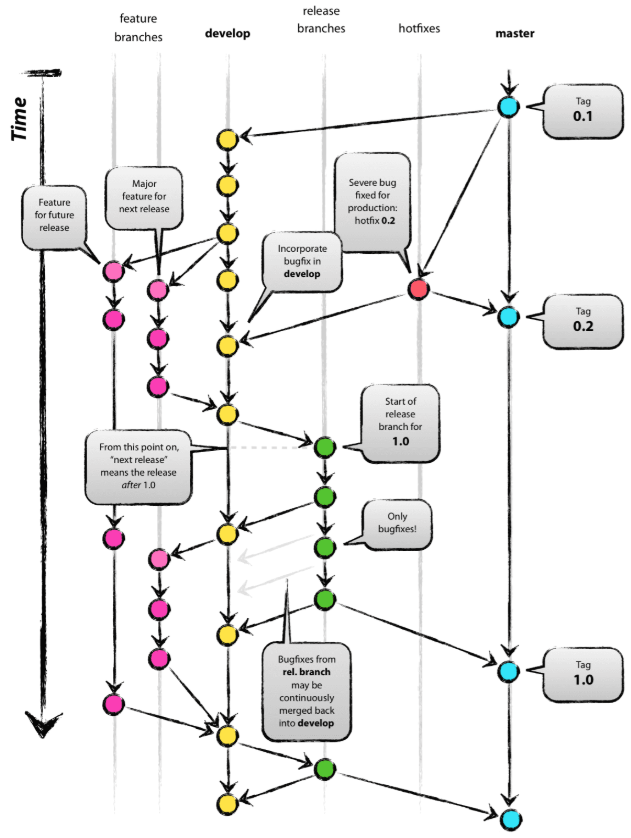

# How we use GitHub

When integrating Git into any project, all developers must have the same understanding of how Git is used. In this document, we collect how we use Git in the BRIDGES project. In Part 1, we outline which branches exist in the BRIDGES project and what their roles are. In other words, we discuss the “branching model”. We also cover the adjacent topic of versioning. In Part 2, we revisit step by step how contributors, internal or external, make changes to the Git project, providing command examples. This chapter also discusses the steps within a pull request. Although only relevant on a handful of occasions, we will assume that GitHub is used as a repository hosting service and VS Code is used as a coding environment.


## Part 1: Branching Model
BRIDGES’ branching model closely follows the Gitflow branching model [(Link)](https://nvie.com/posts/a-successful-git-branching-model/). We use four types of branches: main branch, development branch, feature branches, and hotfix branches. While of the former two there exists exactly one each and they exist indefinitely, multiple hotfix and feature branches can exist at once and new hotfix and feature branches may be created and old branches deleted. 

### Main branch and versioning:
The main branch in BRIDGES, sometimes called master branch in the past, holds the most recent version of BRIDGES that was used in an academic publication. In other words, every time a BRIDGES paper is published, the code used for that paper is perpetuated as a new pull request to the main branch. In this way, previous research can be reproduced by downloading BRIDGES at the development state when a given publication was published.

In addition, each update to the main branch receives a three-digit version tag, where the middle number increases with every published paper. The last digit increases with any fixed bug between papers. And the first digit only increases, when a new BRIDGES version introduces significant changes that cause interoperability issues between the new and older versions. 

<figure markdown>
  { width="400" }
  <figcaption>Figure 1: BRIDGES' versioning</figcaption>
</figure>

### Development branch:
The development branch holds the BRIDGES code while it is being developed.

### Feature branches:
For every extension of BRIDGES (a feature), the developer creates a feature branch from the development branch. The naming convention for feature branches is “feature-XXX” (e.g., feature-storage). After fully developing a feature, a pull request is opened to merge the feature into the development branch. As part of every pull request the submitting developer has fulfill certain steps, before the pull requests can be merged (see Chapter 2). Once a feature branch is merged into the development branch, the feature branch is deleted.

### Hotfix branches:
If the development or the main branch exhibits any bugs that need to be fixed immediately, a hotfix branch is created from the development or main branch respectively. The issue is solved and the branch is merged back into the development or main branch respectively. The naming convention for hotfix branches is “hotfix-XXX”. Once a hotfix branch is merged back into the parent branch, the hotfix branch is deleted.
The branch types are summarized in the following Figure 1, which is extracted from the Gitflow branching model.


<figure markdown>
  { width="600" }
  <figcaption>Figure 2: Gitflow branching model</figcaption>
</figure>


## Part 2: Daily use of Git step-by-step
To avoid “merge conflicts” when collaborating through GitHub, each developer must work on the correct branches, include changes from other people’s work regularly into their work, and be mindful when integrating their own code into the shared BRIDGES repository. This chapter aims to provide step-by-step instructions for collaborative code development in BRIDGES.
The common Git setup in the BRIDGES team involves the shared online BRIDGES repository on GitHub as well as the individual cloned repositories on each team member’s personal computer. In the following, the shared repository is called “remote” repository (it often has the name “origin”) and the cloned repositories are called “local” repositories (see Figure 3).

<figure markdown>
  { width="800" }
  <figcaption>Figure 3: Visualization of a change flowing through the codebase with key commands.</figcaption>
</figure>

### 2.1. Start developing: Create a feature branch
The development of code happens on a feature branch of a local repository. Therefore, to start developing a new feature, create a feature branch from the development branch.

Make sure you are on the development branch:
```py title="Using terminal:" linenums="1"
git switch develop
```

Create a new branch from the development branch and switch to that new branch:
```py title="Using terminal:" linenums="1"
git checkout -b feature-XXX
```

Switch to an existing branch:
```py title="Using terminal:" linenums="1"
git switch feature-XXX
```

### 2.2. Saving your work in progress:
Once a small logical unit of work is completed (e.g., adding a constraint or adding a dataset), save the change (Str + S), stage the change and commit all the change in the staging area. “Committing a change” is an operation in your local repository. The change is now saved in the history of your local repository. Knowing the “commit ID” of your commit, you could later jump back to your repository at the state of this commit. Commits should be given meaningful commit messages. 

Stage a change:
```title="Using VS code:"
find and click the + sign in the source control tab
```

```py title="Using terminal:" linenums="1"
git add src/example.py
```

Commit a change:
```title="Using VS code:"
find and click the checkmark sign in the source control tab and don’t forget to type a commit message
```
```py title="Using terminal:" linenums="1"
git commit -m "Your commit message"
```

While the feature branch of your local repository now has recorded this change of your code, in the remote repository, your feature branch is still unchanged. (In fact, when you freshly create a new feature branch, the remote repository doesn’t even know about the existence of this new feature branch.) To bring the newest version of your feature branch to the remote repository, “push” your local feature branch to your remote feature branch. This ensures that your latest changes are saved online. For that reason, every commit should also be pushed immediately. 

Push changes from the local feature branch to the remote feature branch:
```py title="Using terminal:" linenums="1"
git push origin feature-XXX
```

Depending on your VS Code and Git settings any push or pull to or from the remote will require your Git passkey.
 
### 2.3. Preventing your feature branch from falling behind:
Remember that the feature branch was created from the development branch. While you develop on your feature branch, the development branch might evolve (because your teammates have finished their features and integrated them into the development branch). It is crucial and your responsibility to transfer these changes into your feature branches regularly. Frequently integrating changes from the development branch into your feature branches, prevents merge conflicts when later integrating your own changes into the development branch. So, how to integrate changes from the remote development branch into your local feature branch?

First, pull the changes from the remote development branch onto your local development branch.
```py title="Using terminal:" linenums="1"
git switch develop
git pull origin develop
``` 

It is good practice to also update your local main branch, although changes on the main branch are much less frequent:
```py title="Using terminal:" linenums="1"
git pull origin maingit pull origin main
```

Secondly, merge the changes from your local development branch into your local feature branch. If you have confidence in the changes and want to make use of Git’s automerge feature, follow the steps:
```py title="Using terminal:" linenums="1"
git switch feature-XXX
git merge develop --no-ff
```

If an automerge is possible it will be conducted. The –no-ff flag (no fast-forward) ensures that a merge commit is recorded in the project history, which will make it easier to backtrack what changes originated from which branches.

If however, you want to carefully inspect all changes before concluding the merge, use: 
```py title="Using terminal:" linenums="1"
git switch feature-XXX
git merge develop --no-commit --no-ff
```

Git will halt before committing the merge and present you with the changes. You can inspect the changes in multiple ways:
```title="Using VS code:"
click the files in the “staged changes” section of the Source Control tab.
``` 
```py title="Using terminal:" linenums="1"
git status and git diff
```

If you agree with the changes, commit them:
```title="Using VS code:"
click the checkmark (commit) in the source control tab 
``` 
```py title="Using terminal:" linenums="1"
git commit -m "Merge updated main into feature branch"
```

If you disagree with the changes: 
```title="Using VS code:"
Unstage changes by clicking the – button in the “staged changes” section of the Source control tab and correct them. Then commit. 
``` 

Alternatively, abort the merge entirely using the terminal:
```py title="Using terminal:" linenums="1"
git merge --abort
```

Now, keep developing. It is good practice to pull the development branch and merge it into your feature branch every time you start a new work session. 

### 2.4. Finishing up your new feature:
Once you have committed and pushed your last change from your local feature branch to the remote feature branch, make sure one more time, that the most recent changes to the development branch have found their way into the feature branch as described in Section 2.3.

Now, create a pull request on GitHub for the remote feature branch to be merged into the remote development branch. As part of the pull request you will be asked to …

1. Confirm that you have updated the documentation according to your changes
1. Confirm that you have updated the Changelog file
1. Run a minimal base case and comment on your observations.

Then at least one other team member will need to study your code before the pull request is confirmed. Urge your team to resolve the pull request timely, so that the development branch does not evolve any further which might trigger new changes to the feature before it can be merged into the development branch.

When GitHub tells you that an automatic merge is not possible, this means that your branch is behind (not up-to-date) with the development branch. Go back to your local repository and perform the steps in section 2.3.

Once the feature is merged into the development branch, all other team members will pull it to their local repositories and merge it into their local feature branches as part of their working routine. 

### 2.5. Delete your feature branch:
Once the feature is fully developed and merged into the development branch, it is good practice to delete the feature branch. This shows that the work related to this feature is completed, prevents team members from accidentally working on wrong branches and keeps the repository clean.
Delete the remote feature branch on GitHub using the Github buttons.
Delete the local feature branch using the terminal:

```py title="Using terminal:" linenums="1"
git branch -d feature-XXX
```

!!! tip

    Have a small test repository with a local and remote version to test the behavior of git commands when you are unsure.

### 2.6. Special case 1: The developer’s Sherlock account as additional local
To facilitate code transfer to and from Sherlock git can be used. This way, it is easy to keep your code update both on your local machine and on GitHub. To make use of Git for file transfer think of your Sherlock code as another local repository as shown in the figure below. Git is already installed on Sherlock, so a local repository on your Sherlock home drive can be created just like on your local machine.

<figure markdown>
  { width="800" }
  <figcaption>Figure 4: Sherlock’s integration as additional local repository.</figcaption>
</figure>

### 2.7. Special case 2: Collaboration with external developers 
External collaborators that are not part of the EAO organization can contribute by forking the BRIDGES repository into their Github account. The forked repository will act as remote repository for that developer. This is illustrated in the figure below. Pull requests are made from the remote feature branch of the forked repository, to the development branch of the original remote repository.

<figure markdown>
  { width="800" }
  <figcaption>Figure 5: Visualization of external collaboration in our project.</figcaption>
</figure>


In large parts, we follow the Gitflow branching model as methodology to develop our code. Find more information [here](https://nvie.com/posts/a-successful-git-branching-model/).

!!! ToDo
    Define steps that need to be done as part of pull requests (run tests, update documentation, maybe have a change log file to keep track of changes over versions)